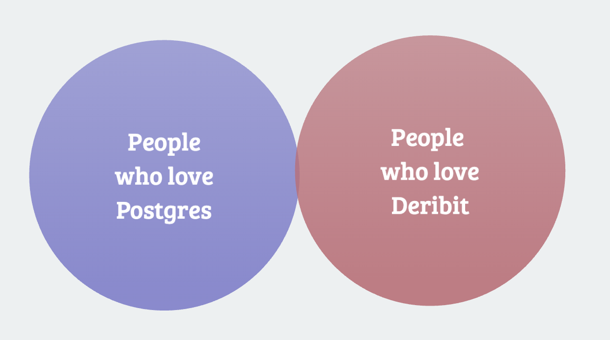

# pg_deribit - Deribit API Wrapper for PostgreSQL

This project provides a PostgreSQL wrapper for the Deribit API, enabling easy interaction with Deribit's cryptocurrency trading platform from PostgreSQL.

It's designed for developers and data analysts who want to integrate Deribit's features into PostgreSQL-based applications or perform complex data analysis.

## Who is this for



## Getting Started

### Prerequisites

- [Docker](https://www.docker.com/)
- [Deribit account](https://www.deribit.com/) (Production or Testnet)
- [psql](https://www.postgresql.org/docs/current/app-psql.html)

### Installation

pg_deribit currently ships as source code.

1. Clone the repository:

   ```bash
   git clone https://github.com/rosssaunders/pg_deribit
   ```

## Quickstart

Run the following commands to start a fresh container changing the port number as needed.

```bash
# stop existing container called pg_deribit
docker stop pg_deribit 2>/dev/null || true

# remove any existing container called pg_deribit
docker rm -f pg_deribit 2>/dev/null || true

# launch the new one
docker build . -t pg_deribit

docker run -d --name pg_deribit -p 5433:5432 \
  -e POSTGRES_PASSWORD=deribitpwd \
  -e POSTGRES_USER=deribit \
  -e POSTGRES_DB=deribit \
  pg_deribit

# connect to the container
PGPASSWORD=deribitpwd psql -h localhost -p 5433 -U deribit -d deribit

# load the extension
create extension if not exists pg_deribit cascade;

# test the extension
select currency
from deribit.public_get_currencies()
order by currency;

# exit the container
\q
```

Connect using your favourite Postgres GUI and get going. For how to use it, see the examples in the doc folder.

## Usage

Refer to the docs folder for examples and the sql/endpoints folder for the full list of endpoints.

## Contributing

Contributions are welcome! Please read our contributing guidelines in CONTRIBUTING.md before submitting pull requests.
